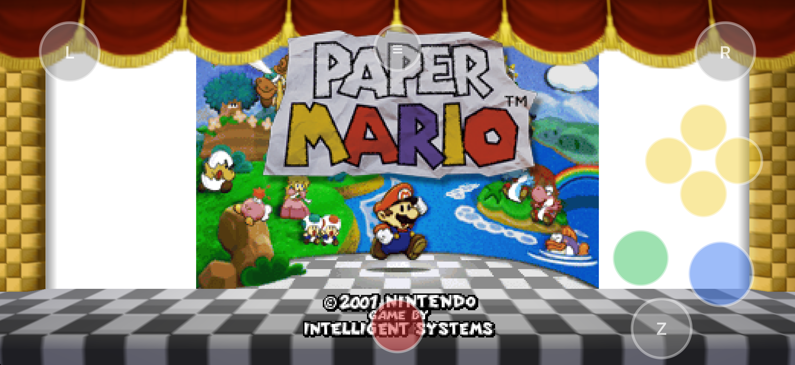

# PaperBoat for iPhone

Play **Paper Mario** on your iPhone — the whole adventure, with saves, music and
cutscenes, the PaperBoat enhancements menu, widescreen, game controllers, and a touch
layout you can drag into whatever shape your thumbs like. Bring your own ROM: the app
extracts it on the device itself, with no PC tools and no companion app.

Built on [PaperBoat](https://github.com/HarbourMasters/PaperBoat) (Harbour Masters'
native Paper Mario 64 port) and
[libultraship](https://github.com/HarbourMasters/libultraship), rendering natively on
**Metal** — no translation layer. 100% vibe coded with lots of passion and attention
to detail.



*The touch layout the port ships by default — C-buttons, L/R, Z and Start, with the
analog stick appearing under your left thumb wherever you put it. Every button can be
dragged, scaled, faded or hidden in the in-game layout editor.*

---

## Install

**Add the SideStore source** — the easiest path, and the app auto-updates when new
versions ship:

| Device | Source URL |
| --- | --- |
| iPhone / iPad | `https://raw.githubusercontent.com/rebelancap/harbourmasters-ports/main/apps-ios.json` |
| Apple Vision Pro | `https://raw.githubusercontent.com/rebelancap/harbourmasters-ports/main/apps-visionos.json` |

In [SideStore](https://sidestore.io) / [AltStore](https://altstore.io): *Sources → **+** →
paste the URL*, then install PaperBoat. These are shared sources — they also carry the
other Harbour Masters ports. **PaperBoat is iPhone/iPad only for now**; it appears in the
visionOS source when a Vision Pro build ships.

**Getting SideStore onto your device** — SideStore itself is installed with
**[iloader](https://github.com/nab138/iloader)** on iPhone and iPad. (On Apple Vision Pro
it is my [iloader fork](https://github.com/rebelancap/iloader/releases#release-visionos),
which runs on an Apple Silicon Mac and pairs over Wi-Fi — no cable, no Dev Strap, no
Xcode.) Then add the source in SideStore exactly as above.

**Prefer a manual install?** Download `paperboat-*-iOS.ipa` from the
[latest release](../../releases/latest) and install it through SideStore/AltStore
yourself ([Sideloadly](https://sideloadly.io) works too).

Then **add your Paper Mario ROM** — the app walks you through it on first launch: pick
the `.z64` in Files, it checks the hash, and extracts it into the game archive on the
device. Extraction takes a couple of minutes; the app restarts into the game when it
finishes.

## Texture packs

The port supports Harbour Masters' `.o2r` mods, including texture packs. **MasterKillua's
official Paper Mario `.o2r` pack is in progress** — when it lands, installing it is:

1. Copy the `.o2r` into *On My iPhone → PaperBoat → **mods*** in the Files app.
2. Relaunch, then turn **Use Alternate Assets** on — *Settings → Enhancements → Graphics
   → Mods*, or the same checkbox in the **Mod Menu**.

That toggle is **off by default in this port**, so nothing happens until you tick it —
which also makes it a one-tap A/B against vanilla.

On a phone, prefer the **HD** flavour of any pack over a 4K one. The phone's panel cannot
resolve 4K texel detail, and the extra resident texture memory is what pushes an app into
being killed for memory. The port keeps a texture-memory budget for exactly this reason
(*Settings → iOS*), but a smaller pack is the better fix.

## Features

- **The full game** — every chapter, with saves, audio, music and cutscenes
- **The PaperBoat enhancements menu** — the reason these ports exist: widescreen,
  higher frame rates, and the whole quality-of-life catalogue
- **In-app ROM extraction** — no PC tools, no companion app; pick the ROM in Files and
  the app builds its own game archive
- **60 / 120 Hz**, with real ProMotion support — the game's 30 Hz tick is interpolated up
  to the panel, and the port steps the target down and back up on its own if a device
  ever cannot hold it
- **Supersampling (SSAA)** with a sensible default chosen per device tier — 2x on current
  iPhones — and a slider if you want to spend or save the GPU time
- **Touch controls** on the layout shared across these ports: floating analog stick,
  A/B, the four **C-buttons**, L/R, Z and Start, with a **layout editor** — drag any
  button, scale it, change opacity, and hide the ones you never use
- **Game controllers** (Backbone, DualSense, Xbox…) with the standard N64 mapping,
  rebindable, and menu-aware navigation — the touch layout hides itself while a
  controller is connected
- **Files sharing** — the app's folder is visible in Files, so mods, saves and logs are
  all reachable without a computer
- **Crash backtraces** written to `Documents/crash.txt`, so a bug report can arrive with
  something readable attached
- On-screen **frame rate and thermal readout** for tuning

## Requirements

- An iPhone or iPad on **iOS 16.3 or newer** (upstream PaperBoat's own floor). Builds are
  made against the current iOS release, which is where they are tested
- **SideStore**, installed with [iloader](https://github.com/nab138/iloader)
- Your own **US Paper Mario ROM** (`.z64`). The app verifies its hash and tells you if it
  is not the version it knows

## FAQ

**Do I need a PC to extract the ROM?** No — extraction runs inside the app, on the device.

**Which ROM versions work?** The US release. The app carries the hash it expects and
checks yours against it before extracting.

**The app stopped launching after about a week?** Apps sideloaded with a free Apple
account expire after 7 days (paid developer accounts last a year). SideStore/iloader
refresh them automatically in the background — open the sideloading app and let it
re-sign.

**Found a bug, or it crashed?** The app keeps its own logs and its folder is visible in
**Files** — open *On My iPhone → PaperBoat* and grab:

- `crash.txt` — a backtrace, written if the app died (this is the important one)
- `logs/` — the newest `.log` file

Attach those to a [GitHub issue](../../issues) along with what you were doing and whether
a texture pack was installed. **A crash with no `crash.txt` is usually the app being
killed for memory**, not a crash at all — worth saying so, and saying which pack you had
mounted.

**Is there a Vision Pro build?** Not yet.

---

## Building from source

Requires macOS with Xcode and `cmake` (`brew install cmake`), plus your own ROM.

```sh
scripts/bootstrap.sh          # clone + pin upstream PaperBoat (submodules recursive)
scripts/build-oracle.sh       # native macOS build — the parity reference
scripts/run-oracle.sh         # run it (extracts pm64.o2r from your ROM on first run)

scripts/build-sim.sh          # iOS Simulator build
scripts/run-sim.sh            # install + first-run + screenshot, unattended

scripts/build-ios.sh          # signed iPhone build
scripts/build-release.sh      # the release IPA — developer console compiled out
```

Signing uses your own Apple Developer team: `PAPERBOAT_IOS_TEAM=<your-team-id>`, or
`PAPERBOAT_IOS_SIGNING=OFF` for an unsigned compile proof.

Upstream PaperBoat is vendored **unmodified and pinned by commit**; every local change is
a reviewable patch in `overlay/patches/`, applied by `scripts/apply-overlay.sh`. Each
patch is produced by a generator in `scripts/gen-patch-*.py` that asserts its match
counts, so a silent no-op edit fails the build rather than shipping. Every patch header
says whether it is program-baseline parity, an upstream bug fix worth sending back, or
branding. `scripts/overlay-drill.sh` checks that the whole series reverses to the pin and
re-applies cleanly.

The developer console the scripts refer to is a launch-gated TCP command
bridge, used to drive and read a build from a Mac during development. It is
compiled into every build except the release build, which asserts on its own
binary that no listener survives.

## Credits & license

- [PaperBoat](https://github.com/HarbourMasters/PaperBoat) **1.0.0** by **Caladius** and
  the Harbour Masters contributors — the port this is built on, and the source of its
  iOS target, on-device extractor and enhancements menu
- [libultraship](https://github.com/HarbourMasters/libultraship) (MIT), in the
  [JeodC](https://github.com/JeodC/libultraship) `lus-converge` fork this port pins —
  the platform layer: Fast3D, Metal, audio, input, O2R archives
- [Torch](https://github.com/HarbourMasters/Torch) — the asset extraction pipeline that
  runs inside the app
- PAPER MARIO © **Nintendo** / **Intelligent Systems**. This project is not affiliated
  with or endorsed by Nintendo, ships no Nintendo content, and requires you to supply
  your own legally-obtained ROM.

This repo's own code — the iOS shell in `app/`, the overlay patches and their generators
and scripts in `overlay/` and `scripts/` — is MIT licensed; see
[LICENSE](LICENSE). Upstream PaperBoat and libultraship carry their own licenses and are
unaffected by this one.
